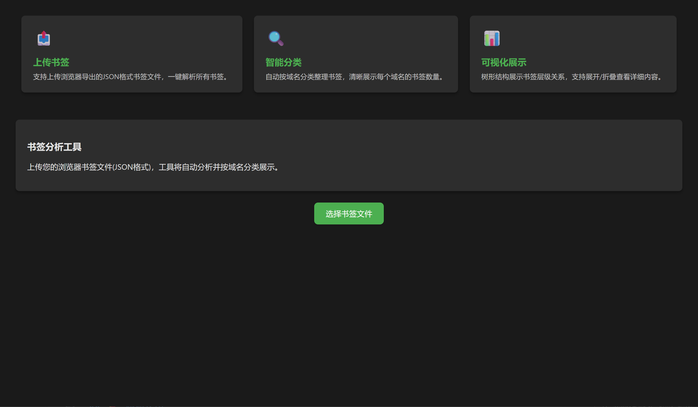

# 🎀 书签清理小助手

✨ 一个实用的书签整理工具，帮你轻松管理浏览器书签！

## 🎯 功能特点
- 🧹 智能分析书签，自动分类整理
- 🌳 树状视图展示，清晰直观
- 🎨 可爱UI设计，使用更愉快

## 🚀 快速开始
1. 安装依赖
```bash
npm install
```
2. 启动开发服务器
```bash
npm run dev
```
3. 构建生产版本
```bash
npm run build
```

## 🖼️ 项目截图



## 💖 感谢使用
希望这个小工具能帮你整理书签，保持浏览器整洁！
